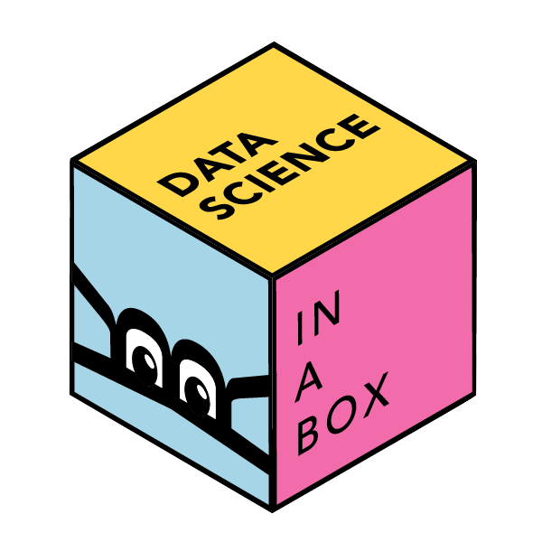

###  [Data Science in a Box](https://datasciencebox.org/) is a repository for open-source course materials for a semester-long, college-level, introductory data science course that teaches R.

---

Data Science in a Box contains the materials required to teach (or learn from) a semester-long, college-level, introductory data science course that teaches R, all of which are [freely-available and open-source](https://github.com/rstudio-education/datascience-box/blob/master/LICENSE.md). The materials include course slide decks, lecture and live coding videos, homework assignments, guided labs, sample exams, a final project assignment, as well as resources for instructors such as pedagogical tips, information on computing infrastructure, technology stack, and course logistics.

The project also features an accompanying R package, [**dsbox**](https://rstudio-education.github.io/dsbox/), which contains datasets used in the course as well as interactive tutorials built with [**learnr**](https://rstudio.github.io/learnr/).

If you want to connect with others who are also teaching out of this curriculum, join the Slack community [here](https://join.slack.com/t/dsboxworkspace/shared_invite/zt-vvjh8ovb-dCy31PATijOrdaz9oVGvVQ).