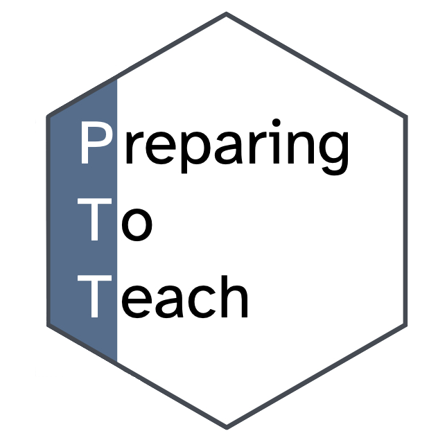

###  [Preparing to Teach](https://preparingtoteach.org/) is designed for graduate students and recent PhDs interested in careers in teaching statistics and data science.

---

This is a one-day workshop to prepare current and recent graduate students for a future role as faculty responsible for teaching statistics and data science to undergraduate students across a variety of disciplines. We envision workshop participants become capable of developing innovative and pedagogically-sound learning experiences for their students inside and outside the classroom and using formative and summative assessment to guide their instructional practice. The ultimate objective of this workshop is to increase the proportion of successful instructors who have the skills, capacity, and inclination to take on the challenges of complex data-oriented teaching in twenty-first century. The workshop also aims to promote interaction, networking, and community building among recent and soon to be PhDs in statistics, data science, and relevant fields who are interested in academic and teaching focused careers and to provide them with valuable insights from leaders in the field. Topics include teaching introductory statistics; teaching data science; teaching-focused career opportunities; opportunities for grants; sharing resources and staying connected. There will be opportunities for interaction and hands-on experience with active learning and computing technologies.

You can browse materials from previous sessions as well as see announcements for upcoming ones [here](https://preparingtoteach.org/).